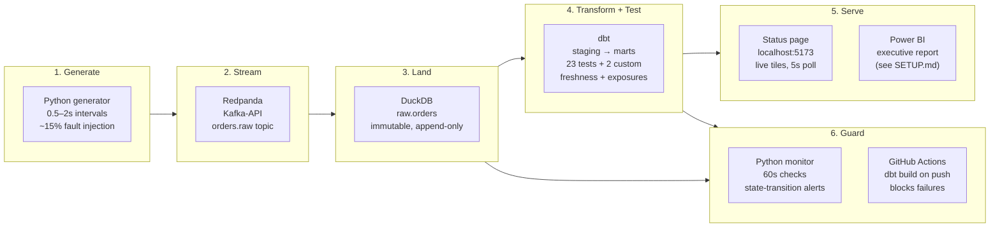

# Pulse — Real-Time Data Platform


> **"A live system that pulls in data as it happens, cleans and checks it automatically, blocks bad data from ever reaching the dashboard, and raises an alarm the moment a pipeline breaks — so the business can always trust what it sees."**

[Case study](docs/case-study.md) · [Power BI setup](serve/powerbi/SETUP.md) · [Capture guide](docs/capture-guide.md)

---

## Quickstart

Requires: Docker, Docker Compose. No cloud account. No credit card.

```bash
git clone https://github.com/Mprtham/pulse-data-platform.git
cd pulse-data-platform
docker compose up
```

| What opens | URL |
|---|---|
| Live status page | http://localhost:5173 |
| Status API (JSON) | http://localhost:8000/status |
| Redpanda admin | http://localhost:9644 |

To run dbt transforms locally (optional — ingest service runs them on a schedule):

```bash
pip install dbt-duckdb
cd transform
dbt build --profiles-dir .
```

---

## Architecture



Bad data is **generated on purpose** (null invoice IDs, negative prices, duplicate order numbers) so the quality layer has something real to catch and reject before it reaches the marts.

---

## Stack

| Layer | Tool | Why |
|---|---|---|
| Stream | **Redpanda** (Kafka-API, single container) | Industry-standard Kafka API; no ZooKeeper overhead |
| Warehouse | **DuckDB** | Columnar, local, BigQuery-compatible SQL — zero cloud cost |
| Transform + Test | **dbt** with **dbt-duckdb** | Analytics engineering standard; cert-validated skill |
| Quality | dbt schema tests + 2 custom singular tests + freshness | Governance layer most junior portfolios lack |
| Lineage | dbt exposures | Declares Power BI + status-page dependency explicitly |
| Ingest / Generator | **Python** (confluent-kafka) | Lightweight, inspectable, fault-injectable |
| Status API | **FastAPI** | Thin REST layer; readable in minutes |
| Status page | **Vite + React** | Dark-first, Deep Signal palette, WCAG AA |
| Power BI | **PBIP** (skeleton committed) | Version-controlled semantic model — see `serve/powerbi/SETUP.md` |
| Packaging | **Docker + docker-compose** | One command, reproducible, £0 |
| CI/CD | **GitHub Actions** | Blocks bad data from merging; green badge proves it |

---

## What it proves

| UK employer asks for | This project shows it via |
|---|---|
| Real-time / streaming pipelines | Redpanda → DuckDB consumer, events every 0.5–2 s |
| Modern data stack / analytics engineering | dbt staging → marts, tested, with lineage via exposures |
| Data governance + quality + lineage | 23 schema tests, 2 custom tests, freshness checks, dbt exposures |
| Reliability / observability | Python monitor: freshness + volume + test-status, state-transition alerts |
| Power BI + SQL | PBIP in git; report built from governed marts (see `serve/powerbi/SETUP.md`) |
| Reproducibility / DevOps | One `docker compose up`; CI blocks regressions on every push |
| Business-outcome thinking | Cost-of-bad-data framing; bad data blocked structurally, not reactively |

---

## Repo layout

```
pulse-data-platform/
├── generator/          # Python event producer — UK retail orders + fault injector
├── ingest/             # Kafka consumer → DuckDB micro-batch writer
├── warehouse/          # DuckDB bootstrap SQL
├── transform/          # dbt project: staging → marts, tests, seeds, exposures
│   ├── models/
│   │   ├── staging/    # stg_orders (view) — clean, typed, null-filtered
│   │   └── marts/      # mart_daily_revenue, mart_hourly_volume (tables)
│   ├── tests/          # assert_revenue_non_negative, assert_no_duplicate_orders
│   ├── seeds/          # CI fixture data (10 clean rows)
│   └── macros/         # generate_schema_name override
├── monitor/            # Python freshness + volume + test-status watcher
├── serve/
│   ├── api/            # FastAPI /status endpoint
│   ├── web-status/     # Vite + React live status page (Deep Signal palette)
│   └── powerbi/        # PBIP skeleton + DeepSignal.json theme + SETUP.md
├── docs/               # case-study.md, capture-guide.md
├── .github/workflows/  # ci.yml — dbt build + test gate
└── docker-compose.yml  # full platform in one command
```

---

## Data domain

Synthetic UK retail / e-commerce orders. Schema modelled on the [UCI Online Retail II dataset](https://archive.ics.uci.edu/dataset/502/online+retail+ii) (InvoiceNo, StockCode, Quantity, UnitPrice, CustomerID, Country). Events are **generated live** — the dataset is never streamed from a static file.

Approximately 15% of events are deliberately corrupted (null invoice ID, negative unit price, null quantity, or a duplicate invoice number from recent history) so the quality layer has genuine faults to catch during a live demo.

---

## Authorship

Built by **Prathamesh Mishra**. All commits authored by Prathamesh Mishra. Synthetic data only — no real customer records.
